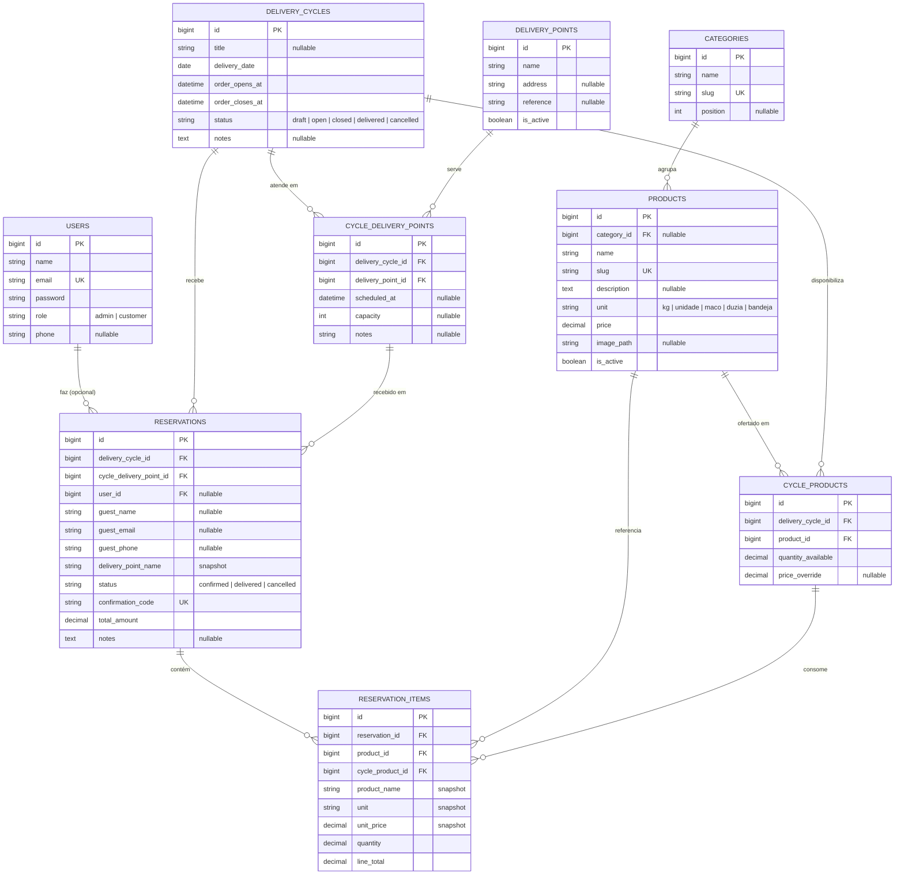

# Horta — Arquitetura da Solução

> Plataforma web para **gerenciar os produtos disponíveis de uma horta** e permitir que o **cliente final reserve produtos** para uma **entrega coletiva semanal agendada**.
>
> **Status:** plano de arquitetura para aprovação (nenhum código escrito ainda).
> **Stack:** Laravel + Inertia + React. **Pagamento:** fora do sistema (na entrega). **Cliente:** conta opcional + reserva como convidado. **Banco:** MySQL/MariaDB. **Entrega:** rota semanal com **múltiplos pontos** — o cliente escolhe onde receber.
>
> **Revisão 2:** a entrega semanal passa por **vários pontos** e cada cliente seleciona em qual receberá (antes: ponto único). Ver §16 para o histórico.

---

## 1. Visão geral

A Horta funciona em **ciclos semanais**. A cada semana o gestor abre um *ciclo de entrega*, define quais produtos foram colhidos e em que quantidade, quais **pontos de entrega** a rota atenderá naquela semana, e abre uma **janela de pedidos**. Os clientes reservam o que quiserem e **escolhem em qual ponto vão receber** enquanto a janela está aberta; após o corte, o gestor gera a **lista de separação/colheita** — agregada e **por ponto** — e roda a **entrega coletiva** passando por cada parada. O pagamento acontece na entrega (dinheiro/PIX manual) — o sistema apenas calcula e registra os valores.

Duas áreas na mesma aplicação:

- **Loja (público/cliente):** catálogo do ciclo aberto, carrinho, escolha do ponto de entrega e reserva. Funciona sem login (convidado) ou com conta (histórico).
- **Painel (admin/gestor):** CRUD de produtos, categorias e **pontos de entrega**, criação e operação dos ciclos (incluindo quais pontos cada ciclo atende), acompanhamento de reservas e listas de separação por ponto.

---

## 2. Stack técnica

Base recomendada: **Starter Kit oficial React da Laravel** (`laravel new --react`), que já entrega autenticação (registro/login/verificação), Inertia, React, TypeScript, Tailwind e componentes shadcn/ui prontos — cobrindo o requisito "cliente cria conta" sem retrabalho.

| Camada | Tecnologia | Versão alvo (jul/2026) |
|---|---|---|
| Linguagem backend | PHP | 8.3+ |
| Framework | Laravel | 12 (maduro) ou 13 (atual) |
| Ponte SPA | Inertia.js | 3.x |
| Frontend | React | 19 |
| Tipagem | TypeScript | 5.x |
| Estilos | Tailwind CSS | 4.x |
| Componentes UI | shadcn/ui + radix-ui | atual |
| Build | Vite | atual |
| Banco de dados | MySQL / MariaDB | 8.x / 11.x |
| Testes | Pest | 3.x |

Requisitos do Inertia v3: PHP 8.2+, Laravel 11+, React 19+.

**Observações de decisão**

- **TypeScript** é o padrão do starter kit oficial e será mantido (melhor DX e menos bugs de contrato entre back e front).
- O antigo **Breeze** foi superado pelos starter kits oficiais; não será usado.
- **Localização:** `locale = pt_BR`, `timezone = America/Sao_Paulo`.
- **shadcn/ui** cobre tabelas, formulários, diálogos e toasts do painel sem construir UI do zero.

---

## 3. Atores e papéis

| Papel | Acesso | O que faz |
|---|---|---|
| **Admin / Gestor** | Login (role `admin`) | Gerencia produtos, categorias, **pontos de entrega**, ciclos e disponibilidades; acompanha e atualiza reservas; gera listas de separação por ponto; marca entregas. |
| **Cliente registrado** | Login (role `customer`) | Navega o catálogo do ciclo aberto, reserva, **escolhe o ponto de entrega**, acompanha histórico e cancela dentro da janela. |
| **Cliente convidado** | Sem login | Reserva informando nome + WhatsApp/e-mail e **escolhendo o ponto**; recebe um **código de confirmação** para consultar/cancelar a reserva. |

A distinção convidado × registrado é resolvida na tabela `reservations` com `user_id` **nulo** para convidados + campos `guest_*`.

---

## 4. Modelo de dados

Diagrama entidade-relacionamento (também disponível em `modelo-de-dados.mermaid`, que renderiza como imagem):



### 4.1 Entidades

**users** — estende a tabela do starter kit com `role` e `phone`.

| Campo | Tipo | Notas |
|---|---|---|
| id | bigint PK | |
| name | string | |
| email | string, único | |
| password | string | hash |
| role | string/enum | `admin` \| `customer` (default `customer`) |
| phone | string, nullable | contato/WhatsApp |
| email_verified_at, remember_token, timestamps | | padrão |

**categories** — organiza o catálogo (ex.: Folhas, Legumes, Temperos).

| Campo | Tipo | Notas |
|---|---|---|
| id | bigint PK | |
| name | string | |
| slug | string, único | |
| position | int, nullable | ordenação |
| timestamps | | |

**products** — catálogo base da horta. **Não guarda estoque** — a disponibilidade é definida por ciclo (ver `cycle_products`).

| Campo | Tipo | Notas |
|---|---|---|
| id | bigint PK | |
| category_id | bigint FK, nullable | |
| name | string | |
| slug | string, único | |
| description | text, nullable | |
| unit | string/enum | `kg`, `unidade`, `maco`, `duzia`, `bandeja`, `litro` |
| price | decimal(10,2) | preço padrão por unidade |
| image_path | string, nullable | foto |
| is_active | boolean | default `true` |
| timestamps | | |

**delivery_cycles** — a entrega coletiva semanal agendada. Os **pontos atendidos** pelo ciclo ficam na relação `cycle_delivery_points` (a rota passa por vários lugares).

| Campo | Tipo | Notas |
|---|---|---|
| id | bigint PK | |
| title | string, nullable | ex.: "Entrega — semana 30/2026" |
| delivery_date | date | dia da entrega coletiva |
| order_opens_at | datetime | abertura da janela de pedidos |
| order_closes_at | datetime | corte dos pedidos |
| status | string/enum | `draft`, `open`, `closed`, `delivered`, `cancelled` |
| notes | text, nullable | |
| timestamps | | |

**cycle_products** — pivot que define **o que** e **quanto** está disponível em cada ciclo. Coração do controle de estoque semanal.

| Campo | Tipo | Notas |
|---|---|---|
| id | bigint PK | |
| delivery_cycle_id | bigint FK | |
| product_id | bigint FK | |
| quantity_available | decimal(10,2) | quantidade ofertada nesse ciclo |
| price_override | decimal(10,2), nullable | preço específico do ciclo (senão usa `products.price`) |
| timestamps | | |
| **único** | (delivery_cycle_id, product_id) | um produto uma vez por ciclo |

> A quantidade **restante** é calculada (não armazenada): `quantity_available − Σ quantidade das reservas ativas`. Ver §7.

**delivery_points** — catálogo reutilizável de pontos por onde a rota pode passar (reaproveitados a cada semana).

| Campo | Tipo | Notas |
|---|---|---|
| id | bigint PK | |
| name | string | ex.: "Praça Central", "Academia X" |
| address | string, nullable | endereço |
| reference | string, nullable | ponto de referência |
| is_active | boolean | default `true` |
| timestamps | | |

**cycle_delivery_points** — pivot que define **quais pontos** a rota atende **naquele ciclo** e o horário previsto em cada parada. É o que o cliente escolhe.

| Campo | Tipo | Notas |
|---|---|---|
| id | bigint PK | referenciado pela reserva |
| delivery_cycle_id | bigint FK | |
| delivery_point_id | bigint FK | |
| scheduled_at | datetime, nullable | **horário estimado** da parada (exibido ao cliente) |
| capacity | int, nullable | limite de reservas no ponto (opcional, Fase 2) |
| notes | string, nullable | |
| timestamps | | |
| **único** | (delivery_cycle_id, delivery_point_id) | um ponto uma vez por ciclo |

> O **estoque é do ciclo** (compartilhado entre todos os pontos) — a escolha do ponto define **onde** o cliente recebe, não altera a disponibilidade. Um limite por parada é opcional via `capacity`.

**reservations** — a reserva de um cliente para um ciclo, **em um ponto de entrega escolhido**.

| Campo | Tipo | Notas |
|---|---|---|
| id | bigint PK | |
| delivery_cycle_id | bigint FK | |
| cycle_delivery_point_id | bigint FK | **ponto escolhido** pelo cliente (deve pertencer ao ciclo) |
| user_id | bigint FK, **nullable** | nulo = convidado |
| guest_name | string, nullable | obrigatório se convidado |
| guest_email | string, nullable | |
| guest_phone | string, nullable | WhatsApp |
| delivery_point_name | string | snapshot do ponto escolhido |
| status | string/enum | `confirmed`, `delivered`, `cancelled` (`pending` opcional, ver §5) |
| confirmation_code | string, único | consulta do convidado |
| total_amount | decimal(10,2) | soma dos itens (informativo — paga na entrega) |
| notes | text, nullable | observação do cliente |
| timestamps | | |

**reservation_items** — linhas da reserva, com **snapshots** para preservar histórico mesmo que o produto/preço mude depois.

| Campo | Tipo | Notas |
|---|---|---|
| id | bigint PK | |
| reservation_id | bigint FK | |
| product_id | bigint FK | referência |
| cycle_product_id | bigint FK | vincula à disponibilidade do ciclo |
| product_name | string | snapshot |
| unit | string | snapshot |
| unit_price | decimal(10,2) | snapshot |
| quantity | decimal(10,2) | |
| line_total | decimal(10,2) | `unit_price × quantity` |
| timestamps | | |

### 4.2 Enums (PHP `enum` tipado)

- `UserRole`: `Admin`, `Customer`
- `CycleStatus`: `Draft`, `Open`, `Closed`, `Delivered`, `Cancelled`
- `ReservationStatus`: `Confirmed`, `Delivered`, `Cancelled` (+ `Pending` se usar moderação)
- `ProductUnit`: `Kg`, `Unidade`, `Maco`, `Duzia`, `Bandeja`, `Litro`

---

## 5. Regras de negócio

1. **Ciclo de entrega.** O admin cria o ciclo (`draft`) com data de entrega e janela (abre/fecha); seleciona os **pontos de entrega** que a rota atenderá (`cycle_delivery_points`, com horário previsto) e os produtos e quantidades (`cycle_products`). Ao publicar, muda para `open`.
2. **Janela de pedidos.** Reservas só são aceitas quando `status = open` **e** `now` ∈ [`order_opens_at`, `order_closes_at`]. Fora disso o catálogo fica somente leitura.
3. **Escolha do ponto de entrega.** Toda reserva **exige** um ponto entre os que o ciclo atende. A validação garante que o `cycle_delivery_point` pertence ao ciclo da reserva; o nome do ponto é congelado como snapshot. *(Opcional)* respeitar `capacity` do ponto.
4. **Disponibilidade por ciclo.** `restante = quantity_available − Σ quantidade em reservas ativas` (ativas = `confirmed` + `delivered`). O **estoque é compartilhado entre os pontos** — a escolha do ponto não altera o restante. O cliente não pode reservar mais do que o restante; a checagem ocorre em transação com trava de linha (§7).
5. **Efetivação.** Sem pagamento, a reserva é **efetivada na hora** (`status = confirmed`) e passa a consumir estoque imediatamente. *(Opcional)* usar `pending` → `confirmed` se o gestor quiser moderar antes; o MVP assume efetivação direta.
6. **Ciclo de vida da reserva.** `confirmed → delivered` (admin, após entregar) ou `→ cancelled` (cliente dentro da janela, ou admin a qualquer momento). **Cancelar devolve** a quantidade ao disponível.
7. **Convidado × registrado.** Convidado consulta/cancela via `confirmation_code` (+ conferência de e-mail/WhatsApp). Registrado vê tudo no histórico da conta. *(Futuro)* convidado pode "reivindicar" reservas ao criar conta com o mesmo e-mail.
8. **Fechamento e separação.** Após o corte, o admin fecha o ciclo (`closed`) e gera a **lista de separação**: total geral por produto, **por ponto de entrega** (para montar a caixa de cada parada) e por cliente. Após entregar, marca reservas como `delivered` e o ciclo como `delivered`.
9. **Preço.** `total_amount` é informativo (pagamento na entrega). Preço vem de `price_override` do ciclo, senão de `products.price`; é congelado como snapshot no item.
10. **Validações.** `quantity > 0`; ponto de entrega obrigatório e válido para o ciclo; respeitar o tipo da unidade (`kg`/`litro` aceitam decimal; `unidade`/`duzia`/`maco`/`bandeja` são inteiros). *(Refinamento Fase 2: passo mínimo/`step` por produto.)*
11. **Um pedido por ciclo (registrado).** Recomendado limitar o cliente logado a uma reserva ativa por ciclo (edita a existente em vez de duplicar). Convidados são identificados pelo código.

---

## 6. Fluxos

### 6.1 Cliente — fazer uma reserva

1. Abre a **home** → vê o ciclo aberto (data de entrega, pontos atendidos, prazo do corte) e o catálogo com o **restante** de cada produto.
2. Adiciona produtos e quantidades ao **carrinho** (estado no front; validado no back).
3. **Checkout:** se logado, dados preenchidos; se convidado, informa nome + WhatsApp/e-mail. **Escolhe o ponto de entrega** entre os que a rota atende no ciclo (com horário previsto) e adiciona observações.
4. **Confirma** → back valida disponibilidade e o ponto em transação → cria `reservation` (com ponto + snapshot) + `reservation_items` (snapshots) → gera `confirmation_code`.
5. Tela de **confirmação** com resumo, ponto/horário escolhido, valor total (a pagar na entrega) e código. Registrado vê no histórico; convidado guarda o código.
6. **Cancelamento** permitido enquanto a janela estiver aberta.

### 6.2 Admin — operar um ciclo

1. Login (role `admin`) → **Dashboard**: ciclo atual, nº de reservas, itens mais reservados, reservas por ponto, valor previsto.
2. Mantém **catálogos base**: categorias, produtos (CRUD, upload de foto) e **pontos de entrega**.
3. **Cria ciclo**: data de entrega, janela; seleciona os **pontos de entrega** da rota (com horário previsto) e os produtos + quantidades disponíveis.
4. **Abre** o ciclo (`open`) → clientes reservam e escolhem o ponto.
5. Acompanha **reservas** em tempo real (inclusive filtradas por ponto); edita/cancela quando necessário.
6. **Fecha** o ciclo (`closed`) após o corte → gera **lista de separação** agregada, **por ponto de entrega** e por cliente (exportável), para montar as caixas de cada parada.
7. Realiza a entrega passando por cada ponto → marca reservas como `delivered` → fecha o ciclo (`delivered`).

---

## 7. Integridade de estoque (concorrência)

Vários clientes podem reservar o mesmo produto ao mesmo tempo. Para não vender além do disponível, a criação da reserva roda em um **serviço transacional**:

```
ReservationService::place(cycle, pontoEscolhido, itens, dadosCliente):
    DB::transaction:
        valida que pontoEscolhido (cycle_delivery_point) pertence ao ciclo
        (opcional) valida capacity do ponto
        para cada item:
            cycleProduct = SELECT ... WHERE id = ? FOR UPDATE      // trava a linha
            restante = cycleProduct.quantity_available
                       − soma(reservation_items ativos desse cycle_product)
            se item.quantity > restante: aborta (erro de disponibilidade)
        cria reservation (status = confirmed, ponto + snapshot do nome) + items
        calcula total_amount
    retorna reservation
```

`lockForUpdate()` (SELECT … FOR UPDATE) serializa reservas concorrentes do mesmo produto; o cálculo do restante por soma dos itens ativos mantém a verdade em uma única fonte (sem contador denormalizado a dessincronizar). O estoque é do ciclo, então a trava independe do ponto escolhido. Cancelamento apenas muda o status → a quantidade volta a ser contada como disponível automaticamente.

---

## 8. Rotas

### 8.1 Público / cliente (`routes/web.php`)

| Método | URI | Controller@ação | Página Inertia |
|---|---|---|---|
| GET | `/` | `CatalogController@index` | `Catalog/Index` |
| GET | `/produtos/{product}` | `CatalogController@show` | `Catalog/Show` (opcional) |
| GET | `/carrinho` | `CartController@index` | `Cart/Index` |
| POST | `/reservas` | `ReservationController@store` | — (redirect) |
| GET | `/reservas/{reservation}/confirmacao` | `ReservationController@confirmation` | `Reservation/Confirmation` |
| GET | `/consultar-reserva` | `ReservationLookupController@show` | `Reservation/Lookup` (convidado, por código) |
| DELETE | `/reservas/{reservation}` | `ReservationController@destroy` | — |
| GET | `/minhas-reservas` | `Customer/ReservationController@index` | `Customer/Reservations` (auth) |

Os pontos atendidos pelo ciclo aberto chegam ao front como props do Inertia (catálogo/checkout) — não há rota pública extra para listá-los.

+ rotas de autenticação (login, registro, verificação, etc.) do starter kit.

### 8.2 Admin (`prefix = /admin`, middleware `auth` + `admin`)

| Método | URI | Controller |
|---|---|---|
| GET | `/admin` | `Admin/DashboardController@index` |
| resource | `/admin/categorias` | `Admin/CategoryController` |
| resource | `/admin/produtos` | `Admin/ProductController` |
| resource | `/admin/pontos` | `Admin/DeliveryPointController` |
| resource | `/admin/ciclos` | `Admin/DeliveryCycleController` |
| POST | `/admin/ciclos/{cycle}/abrir` | `@open` |
| POST | `/admin/ciclos/{cycle}/fechar` | `@close` |
| GET | `/admin/ciclos/{cycle}/separacao` | `@pickingList` (agrega total e **por ponto**) |
| GET | `/admin/ciclos/{cycle}/reservas` | `Admin/ReservationController@index` (filtrável por ponto) |
| PATCH | `/admin/reservas/{reservation}/status` | `Admin/ReservationController@updateStatus` |

Os pontos do ciclo são gerenciados **dentro** do formulário de ciclo (store/update), não em rota separada.

---

## 9. Telas e componentes (React / Inertia)

**Páginas** (`resources/js/pages/`)

- `Catalog/Index` — banner do ciclo aberto (com pontos atendidos) + grade de produtos com restante e botão de reservar.
- `Cart/Index` — revisão do carrinho e ajuste de quantidades.
- `Reservation/Checkout` — dados do cliente (convidado ou logado) + **seleção do ponto de entrega** + confirmação.
- `Reservation/Confirmation` — resumo + ponto/horário + código.
- `Reservation/Lookup` — consulta de reserva por código (convidado).
- `Customer/Reservations` — histórico do cliente logado.
- `auth/*` — login, registro etc. (starter kit).
- `admin/Dashboard`
- `admin/categories/{Index,Form}`
- `admin/products/{Index,Form}`
- `admin/points/{Index,Form}` — pontos de entrega
- `admin/cycles/{Index,Form,Show}` — o formulário seleciona **pontos + produtos** do ciclo
- `admin/cycles/PickingList` — separação agregada e **por ponto**
- `admin/reservations/Index` — filtrável por ponto

**Componentes** (`resources/js/components/`)

`ProductCard`, `CartDrawer`, `QuantityInput`, `CycleBanner`, `DeliveryPointSelector`, `StatusBadge`, `DataTable` (shadcn), `EmptyState`, `ConfirmDialog`.

**Layouts**: `AppLayout` (loja) e `AdminLayout` (painel com navegação lateral).

O **carrinho** vive no estado do front (React state/context, persistido em `localStorage`); a verdade de disponibilidade e a validade do ponto são sempre revalidadas no back ao confirmar.

---

## 10. Estrutura de pastas (backend)

```
app/
  Enums/            UserRole, CycleStatus, ReservationStatus, ProductUnit
  Models/           User, Category, Product, DeliveryCycle, CycleProduct,
                    DeliveryPoint, CycleDeliveryPoint,
                    Reservation, ReservationItem
  Http/
    Controllers/    CatalogController, CartController, ReservationController,
                    ReservationLookupController, Customer/ReservationController,
                    Admin/{Dashboard,Category,Product,DeliveryPoint,DeliveryCycle,Reservation}Controller
    Requests/       StoreReservationRequest, StoreProductRequest,
                    StoreDeliveryCycleRequest, StoreDeliveryPointRequest, ...
    Middleware/     EnsureUserIsAdmin
  Policies/         ProductPolicy, DeliveryPointPolicy, DeliveryCyclePolicy, ReservationPolicy
  Services/         ReservationService, DeliveryCycleService, PickingListService
database/
  migrations/       (uma por tabela + ajuste em users)
  seeders/          DatabaseSeeder, AdminUserSeeder, CategorySeeder,
                    ProductSeeder, DeliveryPointSeeder, DemoCycleSeeder
  factories/        ProductFactory, DeliveryCycleFactory, DeliveryPointFactory,
                    ReservationFactory
routes/             web.php, auth.php
resources/js/       pages/, components/, layouts/, types/
tests/              Feature/ (fluxo de reserva, disponibilidade, ponto, papéis), Unit/
```

---

## 11. Autenticação e autorização

- **Autenticação:** sessão do starter kit (registro/login/verificação de e-mail prontos).
- **Papéis:** coluna `role` + enum `UserRole`.
- **Middleware `admin`** (`EnsureUserIsAdmin`) protege o grupo `/admin`.
- **Policies:** `ReservationPolicy` — dono (ou admin) vê/cancela; `ProductPolicy`/`DeliveryPointPolicy`/`DeliveryCyclePolicy` — só admin escreve.
- **Convidado:** acesso à própria reserva via `confirmation_code`. Para endurecer, usar **URLs assinadas** (`signed`) além do código.
- **Seed inicial:** um usuário admin padrão (credenciais documentadas no README e trocadas no primeiro acesso).

---

## 12. Dados de demonstração (seeders)

- **Admin** padrão (`admin@horta.local` / senha documentada).
- Categorias: Folhas, Legumes, Temperos, Frutas.
- ~10 produtos com unidades variadas e preços.
- **Pontos de entrega**: 3 exemplos (ex.: "Praça Central", "Academia X", "Portaria do Condomínio Y").
- **Um ciclo `open`** com janela válida, disponibilidades e **2–3 pontos** atendidos (com horário previsto), para testar o fluxo de reserva de imediato.
- Algumas reservas de exemplo (registrado + convidado, em pontos diferentes).

---

## 13. Roadmap de implementação

**Fase 0 — Fundação**
Starter kit React, `role` + middleware `admin`, enums, migrations base, seeders, layouts.

**Fase 1 — MVP (núcleo do pedido)**
CRUD de categorias, produtos e **pontos de entrega**; CRUD de ciclos + disponibilidades + **pontos atendidos** (com horário previsto); abrir/fechar ciclo; catálogo público do ciclo aberto; carrinho; reserva (convidado + registrado) **com escolha do ponto de entrega** via `ReservationService` transacional; tela de confirmação + consulta por código; painel de reservas do admin; **lista de separação agregada e por ponto**.

**Fase 2 — Operação e conforto**
Histórico do cliente; cancelamento self-service; dashboard com métricas; upload de imagens; passo/mínimo por unidade; **capacidade/limite de reservas por ponto**; exportar lista de separação por ponto (CSV/PDF); URLs assinadas para convidado.

**Fase 3 — Futuro**
Notificações (e-mail e/ou WhatsApp: abertura do ciclo, confirmação com ponto/horário, lembrete de entrega); pagamento online (PIX/Mercado Pago) — a modelagem já isola o pagamento; **entrega em endereço do cliente** como modalidade adicional ao ponto coletivo; **recorrência** (gerar o próximo ciclo a partir de um modelo semanal, com os pontos habituais); relatórios; PWA para uso no celular.

---

## 14. Decisões técnicas e não-funcionais

- **Dinheiro:** `decimal(10,2)` em BRL com casts de valor. *(Alternativa mais robusta: inteiros em centavos — avaliar se houver pagamento online na Fase 3.)*
- **Disponibilidade:** calculada por soma dos itens ativos (fonte única de verdade), com trava transacional — sem contador denormalizado. O **estoque é do ciclo**, compartilhado entre os pontos; o ponto só define onde o cliente recebe.
- **Pontos de entrega:** modelados como catálogo reutilizável (`delivery_points`) + vínculo por ciclo (`cycle_delivery_points`), permitindo horários e limites por parada sem duplicar cadastro a cada semana.
- **Snapshots** nos itens de reserva e no nome do ponto preservam nome/unidade/preço/ponto históricos.
- **Validação** concentrada em Form Requests; regras de negócio em Services.
- **Tipos compartilhados:** props do Inertia tipadas em TypeScript (`resources/js/types/`).
- **Testes (Pest):** cobrir reserva feliz, esgotamento de estoque, concorrência, escolha/validação de ponto, permissões de papel e cancelamento/devolução.
- **i18n:** UI em pt-BR; textos centralizados para futura tradução.
- **Deploy (sugestão):** qualquer host PHP 8.3 + MySQL (Forge/Ploi/VPS); assets via `npm run build`. A definir na etapa de infraestrutura.

---

## 15. Pontos em aberto (para a próxima rodada)

1. **Moderação de reservas:** efetivar direto (`confirmed`) — assumido — ou exigir aprovação do gestor (`pending`)?
2. **Pontos de entrega:** ✔ definido — rota com múltiplos pontos; o cliente escolhe onde receber e vê o **horário estimado** de cada parada. `capacity` (limite por ponto) fica para a **Fase 2**.
3. **Entrega em endereço:** além dos pontos coletivos, haverá opção de entrega no endereço do cliente (Fase 3) ou só pontos?
4. **Identidade visual:** há logo, cores e nome definitivo da horta para o tema?
5. **Limite por cliente:** manter "uma reserva ativa por ciclo" para registrados?
6. **Unidades:** a lista `kg/unidade/maço/dúzia/bandeja/litro` cobre os produtos reais?
7. **Notificações no MVP:** e-mail de confirmação (com ponto/horário) já entra na Fase 1 ou fica para a Fase 3?

> Ao aprovar este plano (com ajustes onde quiser), sigo para a **Fase 0 + Fase 1** escrevendo o código: migrations, models, enums, serviço de reserva, controllers, telas React e seeders — tudo documentado.

---

## 16. Histórico de revisões

| Revisão | Data | Mudança |
|---|---|---|
| 1 | 23/07/2026 | Versão inicial: modelo de dados, regras, fluxos, rotas, telas, roadmap. Entrega em ponto único. |
| 2 | 23/07/2026 | **Múltiplos pontos de entrega**: novas entidades `delivery_points` e `cycle_delivery_points`; reserva vinculada ao ponto escolhido (com snapshot); estoque mantido por ciclo (compartilhado entre pontos); regras, fluxos, rotas, telas, seeders e roadmap atualizados; lista de separação por ponto. |
| 3 | 23/07/2026 | Confirmado que o **horário de cada parada é estimado** (exibido ao cliente); `capacity` adiado para a Fase 2. Início da implementação — camada de dados e domínio (backend). |
| 4 | 23/07/2026 | **Fase 0 + Fase 1 implementadas** (full-stack): enums, migrations, models, services, camada HTTP (controllers público/admin, form requests, middleware `admin`), autenticação de sessão com papéis, seeders e 17 testes verdes; frontend Inertia + React + TypeScript completo (loja: catálogo/carrinho/checkout com escolha de ponto/confirmação/consulta/histórico; painel: dashboard, CRUD de categorias/produtos/pontos/ciclos, lista de separação por ponto, reservas filtráveis). Banco: MySQL (`horta`); testes em `horta_test`. |
